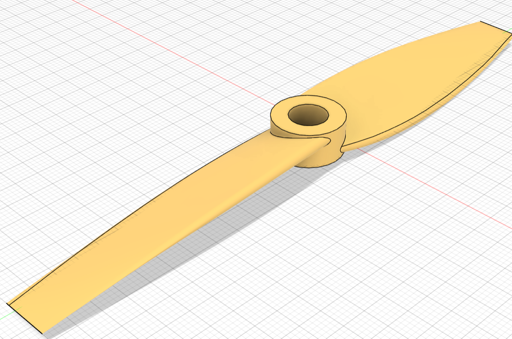
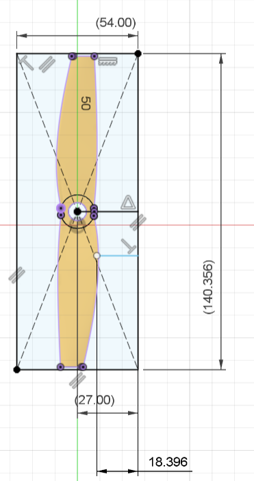
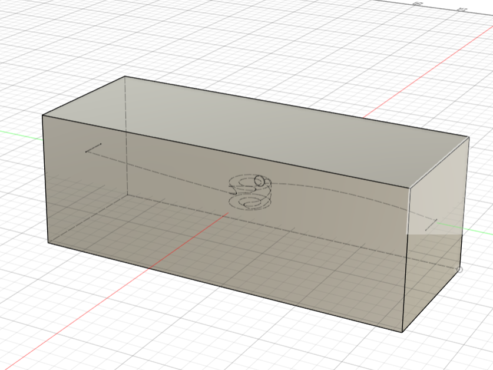
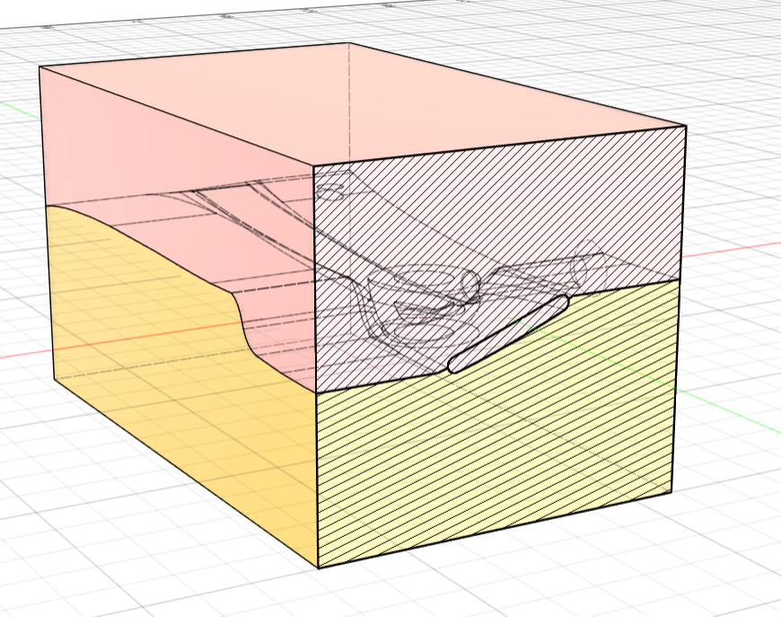
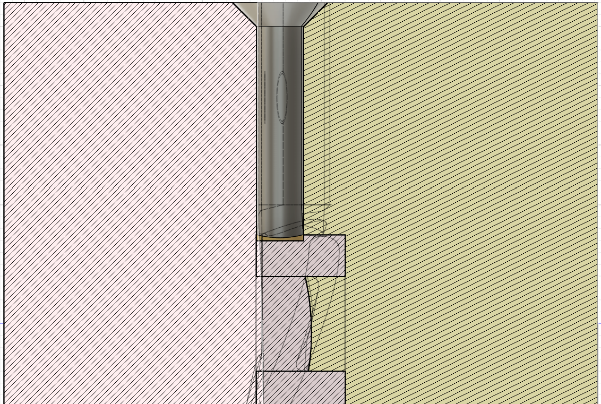
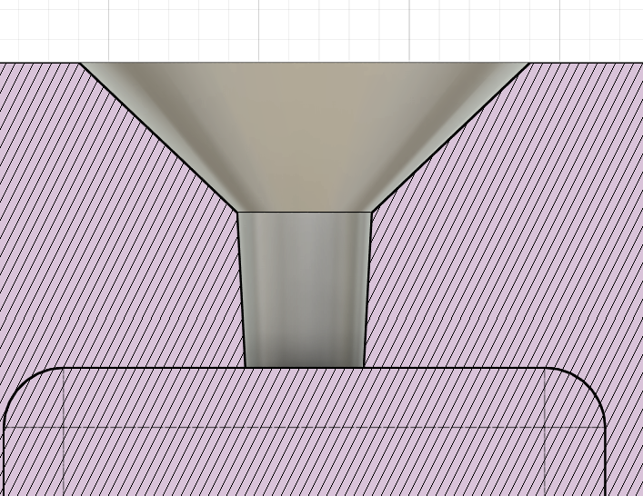

Here’s a refined version of your guide with improved flow, grammar, and a bit more clarity while keeping the practical, hands-on tone:

---

# Hands-On Guide: Creating an Example Mold with CAD

This guide walks you through the process of designing a simple injection mold using CAD software. We’ll use **Fusion 360 (non-commercial version)** for thes example, but you can follow along with any CAD program you prefer.

---

## 1. Choose a Test Object

For this tutorial, we’ll design a mold for a **drone propeller**.
You can download its STL and STEP files here: [Prop Mold Example](Mold%20Examples/Prop%20Mold).

If your model is already in your CAD program, great! Otherwise, import it.

> ⚠️ If your model is in STL format, you may need to **convert it into a solid body** before continuing.

---

## 2. Create the Mold Body

We start by creating a solid mold block around the propeller. Here’s an example:

---

## 3. Cutting and Boolean Operations

You might think the next step is simple:

1. Subtract the propeller from the mold block.
2. Split the block into two halves.
3. Add a sprue (injection entry) and vent hole.

But in reality, it’s not that straightforward.

The propeller’s complex geometry means that if we split the mold incorrectly, parts of the propeller could get stuck inside the cavity, making removal impossible:

---

### 3.1 Splitting Along the Correct Plane

To solve this, we must always split the mold **along the central plane of the propeller**:

Here’s how:

1. Create a **reference surface** through the middle of the propeller.
2. Use this surface to split the mold body.
3. Perform the boolean subtraction of the propeller.

> 🔍 This step is more advanced than most beginner molds require, but it shows how creative design choices can make the mold usable.

---

## 4. Designing the Sprue and Gate

The **sprue** is the channel that leads into the mold cavity, and the **gate** is the entry point where plastic flows in.

When designing them, keep in mind:

* If the mold split **already cuts through the sprue**, you can design it as a simple straight cylinder:
  

* If not, design the sprue with a **tapered cone shape**. This ensures that the solidified plastic can be removed easily:
  

* Add a **chamfer** at the sprue entry. This helps the injection nozzle seal tightly against the mold.

---

## 5. Exporting the Mold

Finally, export the mold halves as **STL files** from your CAD program. These files can then be 3D printed, CNC milled, or sent to a service bureau for fabrication.

---

