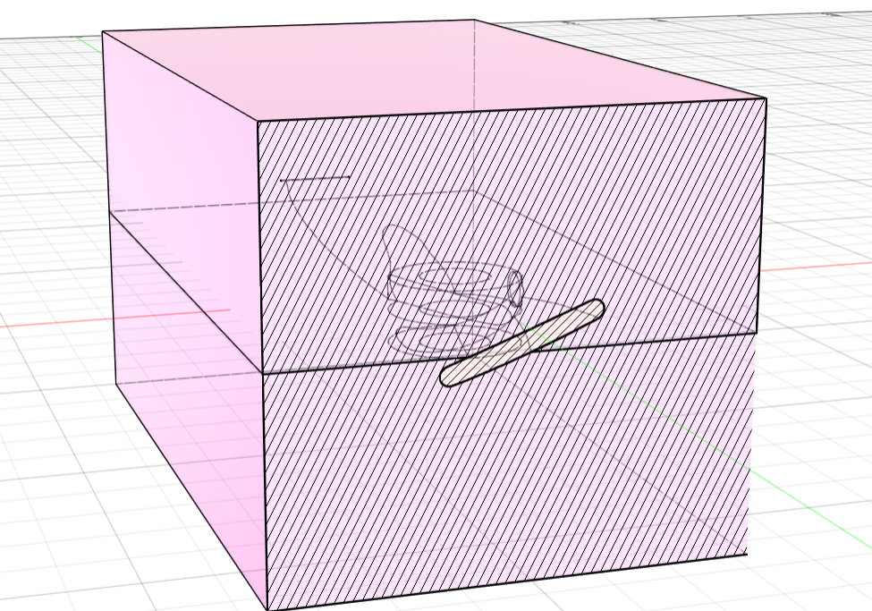

# Hands-On Guide: Creating an Example Mold with CAD

This guide will walk you through the process of creating a simple injection mold, giving you an idea of the workflow and how to get started.

We will use the **non-commercial software Fusion 360** for this example, but feel free to use your preferred CAD program.

---

## 1. Find a Test Object

For this guide, we will work with a **drone propeller**. You can find its STL and STEP models [here](Mold%20Examples/Prop%20Mold).

If you already have your model in your CAD software, perfect! Otherwise, import it.

> ⚠️ If your model is in STL format, you may need to **convert it to a solid body** in your CAD software before proceeding.

---

## 2. Creating the Body of the Mold

Here is an example of how we created the mold body around the propeller:

---

## 3. Boolean Operations and Cutting

At first glance, the next logical step might seem to:

1. Perform a boolean operation to subtract the propeller from the mold body.
2. Split the mold into two halves.
3. Add a chamfered entry for the plastic and a vent hole.

However, **it’s not that simple in this case**.

The propeller has complex geometry, and if we cut the mold in the middle arbitrarily, some parts of the propeller may get stuck and be impossible to remove. This issue is illustrated below:

---

### 3.1 Cutting Along the Correct Plane

To avoid this problem, we always need to cut the mold **along the central plane of the propeller**:

To achieve this, we:

1. Created a **reference surface** that passes through the middle of the propeller.
2. Split the mold body along this surface.
3. Performed the boolean subtraction.

> Note: This step is more advanced than what most beginner molds require. It is included here to demonstrate how sometimes you need creative solutions to make a mold work properly.

---

## Designing the gate and the sprue
Now we need to design the hole, through which we later inject the plastic. This hole is called gate. The channel in to the cavity is called sprue. 
When we desin the gate, we need to pay attention to some details. 

Depending on the orientation of the cut, we need to design the sprue in a cone shape. If the mold cuts the sprue, we can ignore the angle.

If not we need the cone shape, so its easier to remove the plastic from the sprue.

Also we need to champher the sprue, so the nozzle has a better contact to the mold.

