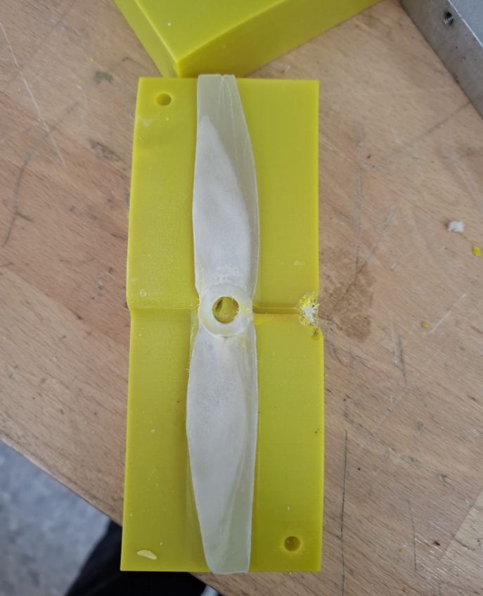

# Low-Cost Injection Molding at the Open Lab

This repository documents an ongoing project exploring low-cost injection molding at the Open Lab. The key idea: using MSLA and FDM 3D printing to create custom molds — an affordable and accessible approach for makers, educators, and FabLabs.

---