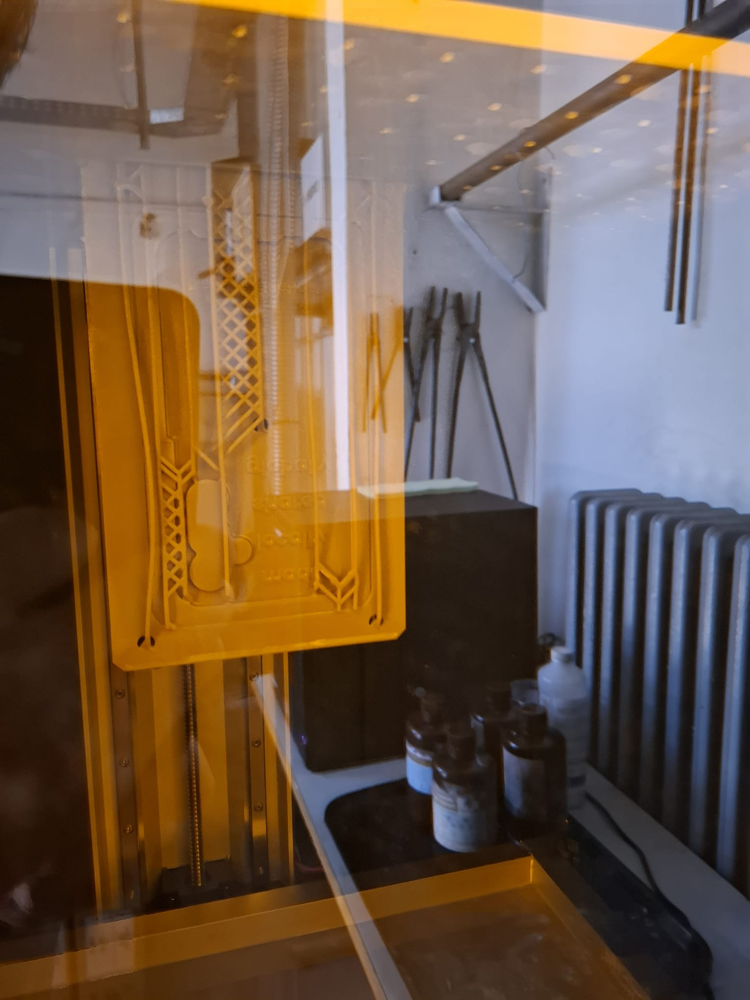

# Low-Cost Injection Molding at the Open Lab

This repository documents an ongoing project exploring low-cost injection molding at the Open Lab. The key idea: using MSLA and FDM 3D printing to create custom molds — an affordable and accessible approach for makers, educators, and FabLabs.

## Current Status

We are still in the process of setting up and learning how to use the injection molding machines available at the Open Lab. In parallel, we are testing the suitability of MSLA-printed molds and evaluating different materials and printing parameters.

A full documentation including tutorials, example projects, and mold design guidelines will be added here soon.

Stay tuned!
